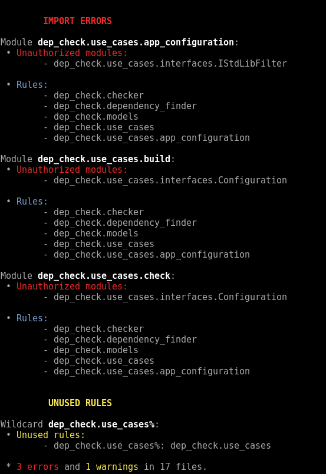

# dep-check

[](https://pypi.python.org/pypi/dep-check) [](https://circleci.com/gh/lumapps/dep-check/tree/master)

## Version: Pre-alpha

**dep-check** is a Python dependency checker. It lets you write rules to define what each module can import, **dep-check** can then parse each source file in your project to verify everything is in order. You can also use it to draw a dependency graph for your project.

**Free software:** MIT license

## Supported languages

* [Python](https://www.python.org/)
* [Go](https://golang.org/)

By default, the tool assumes it's operating on a Python project.

## Installation

To install **dep-check**, run this command:

```sh
pip install dep-check
```

This is the preferred method to install **dep-check**, as it always
installs the most recent stable release.

If you don't have [pip](https://pip.pypa.io) installed, this [Python installation guide](http://docs.python-guide.org/en/latest/starting/installation/) can guide you through the process.

You can also see [other installation methods](https://github.com/lumapps/dep-check/blob/master/doc/installation.md).

## Usage

### Build your config file

```sh
dep_check build <ROOT_DIR> [-o config.yaml] [--lang LANG]
```

Argument | Description | Optional | Default
-------- | ----------- | -------- | -------
ROOT_DIR | The project root directory, containing the source files | :x: | *N/A*
-o / --output | The output file (yaml format) | :heavy_check_mark: | dependency_config.yaml
--lang | The language the project is written in | :heavy_check_mark: | python

This command lists the imports of each module in a yaml file. Use this fileas as a starting point to write dependency rules on which module can import what, using wildcards.

Here is an example of additional rules added to the initial yaml file:

```yaml
---

dependency_rules:
'*':
    - dep_check.models
    - dep_check.dependency_finder
    - dep_check.checker

dep_check.infra.io:
    - dep_check.use_cases%
    - jinja2
    - yaml

dep_check.infra.std_lib_filter:
    - dep_check.use_cases.interfaces

dep_check.use_cases%:
    - dep_check.use_cases.app_configuration
    - dep_check.use_cases.interfaces

dep_check.main:
    - '*'

lang: python
local_init: false
```

* Use `*` to include any string, even an empty one.
* Use `%` after a module name (e.g. `my_module%`) to include this module along with its sub-modules.

Here, for instance, the configuration file defines that `dep_check.infra.io` can import `dep_check.use_cases`, along with `dep_check.use_cases.build`, `dep_check.use_cases.check`, and so on.

*To see all the supported wildcards, check the [User Manual](https://github.com/lumapps/dep-check/blob/master/doc/usage.md#writing-your-own-configuration-file).*

### Check your config

Once your config file is ready, run

```sh
dep_check check <ROOT_DIR> [-c config.yaml] [--lang LANG]
```

Argument | Description | Optional | Default
-------- | ----------- | -------- | -------
ROOT_DIR | The root directory of your project, containing the source files | :x: | *N/A*
-c / --config | The yaml file in which you wrote the dependency rules | :heavy_check_mark: | dependency_config.yaml
--lang | The language the project is written in | :heavy_check_mark: | python

The command reads the configuration file, and parses each source file. It then verifies, for each file, that every `import` is authorized by the rules defined in the configuration file.

When it's done, it writes a report on the console, listing import errors by module and unused rules:



### Draw a dependency graph

**You need to have graphviz installed to run this command**

```sh
dep_check graph <ROOT_DIR> [-o file.svg/dot] [-c config.yaml] [--lang LANG]
```

Argument | Description | Optional | Default
-------- | ----------- | -------- | -------
ROOT_DIR | The project root directory of, containing your source files | :x: | *N/A*
-o / --output | The output file you want (svg or dot format) | :heavy_check_mark: | dependency_graph.svg
-c / --config | The graph configuration file containing options (yaml format) | :heavy_check_mark:| None
--lang | The language the project is written in | :heavy_check_mark: | python

*Note : if you generate a svg file, a dot file is also created in `/tmp/graph.dot`*

A lot of options are available to customize your graph (hide some modules, add layers etc.). Check the [User Manual](https://github.com/lumapps/dep-check/blob/master/doc/usage.md#adding-options) for more information.

## Contributing

If you want to make a contribution, be sure to follow the [Contribution guide](https://github.com/lumapps/dep-check/blob/master/doc/contributing.md).

## Credits

This package was created with [Cookiecutter](https://github.com/audreyr/cookiecutter) and the
[audreyr/cookiecutter-pypackage](https://github.com/audreyr/cookiecutter-pypackage) project template

## Authors & contributors

Check out all the [Authors and contributors](https://github.com/lumapps/dep-check/blob/master/doc/authors.md) of this project.
